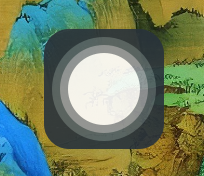
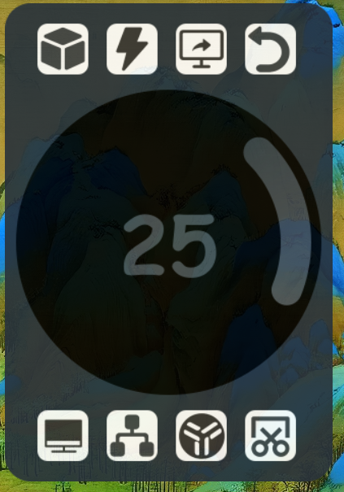
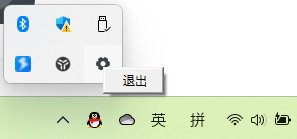

# floating_ball
基于pyside6开发的windows平台悬浮球工具

“双窗口悬浮球.py”用于在解释器内运行

“双窗口悬浮球_编译.py”用于pyinstaller打包


启动后显示一悬浮球窗口



触摸点击或鼠标点击后显示菜单



各按钮功能

1. 启动任务视图
2. 启动quicker
3. 切换显示器，用于将悬浮窗直接移动到另一显示器上，也可以通过鼠标拖动到另以显示器实现
4. 返回悬浮球
5. 显示桌面
6. 启动任务管理器
7. 启动utools
8. 截图

对于中间滑块，拖动滑块部分调节音量、拖动中心部分移动窗口、单击中心部分播放或暂停音乐


程序启动会同时创建一托盘图标，左键单击托盘负责隐藏或显示悬浮球，右键托盘可选择“退出”关闭程序




# 编译

pyinstaller编译命令

```bash
pyinstaller --onefile --noconsole --icon=.\images\float.ico --add-data ".\images;images" --add-data "C:\Users\rzdby\anaconda3\lib\site-packages\PySide6\plugins\platforms;platforms" 双窗口悬浮球_编译.py
```

其中，路径

```bash
C:\Users\rzdby\anaconda3\lib\site-packages\PySide6\plugins\platforms
```

需要设置为对应QT platforms路径

可以利用“双窗口悬浮球.py”内

```python
import os, PySide6 
dirname = os.path.dirname(PySide6.__file__)
plugin_path = os.path.join(dirname, 'plugins', 'platforms')
print(plugin_path)
```

获取该路径

