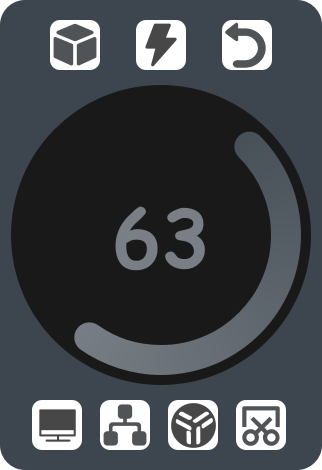

# floating_ball
基于pyside6开发的windows平台悬浮球工具

“双窗口悬浮球.py”用于在解释器内运行

“双窗口悬浮球_编译.py”用于pyinstaller打包


启动后显示一悬浮球窗口


触摸点击或鼠标点击后显示菜单



> 按钮功能目前为：打开任务视图、调节音量、截图、显示桌面、启动quicker、启动utools

程序启动会同时创建一托盘图标，单击托盘负责隐藏或显示悬浮球，右键托盘可选择“退出”关闭程序


# 编译

pyinstaller编译命令

```bash
pyinstaller --onefile --noconsole --add-data ".\images;images" --add-data "C:\Users\rzdby\anaconda3\lib\site-packages\PySide6\plugins\platforms;platforms" 双窗口悬浮球_编译.py
```

其中，路径

```bash
C:\Users\rzdby\anaconda3\lib\site-packages\PySide6\plugins\platforms
```

需要设置为对应QT platforms路径

可以利用“双窗口悬浮球.py”内

```python
import os, PySide6 
dirname = os.path.dirname(PySide6.__file__)
plugin_path = os.path.join(dirname, 'plugins', 'platforms')
print(plugin_path)
```

获取该路径

